# Video 1 - ¿Por qué usar un sistema de control de versiones como git?

Un sistema de control de versiones como git nos ayuda a guardar el historial de cambios y crecimiento de los archivos de nuestro proyecto.
En realidad dichos cambios pueden tener similitudes, algunas veces los cambios pueden ser solo una palabra o una parte específica de una archivo específico. 
Git está optimizado para guardar todos estos cambios de forma atómica e incremental, o sea aplicando cambios sobre los cambios anteriores y así hasta el inicio de nuestro proyecto.

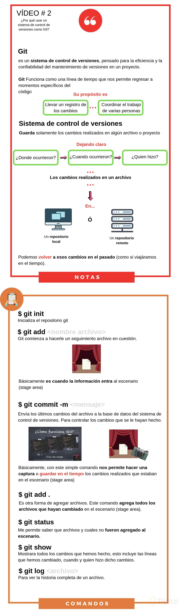


# Video 2 - ¿Qué es git?

## ¿Qué es git?
 
 Git es un sistema de control de versiones distribuido, diseñado por Linus Torvalds. Está pensando en la eficiencia y la confiabilidad del mantenimiento de versiones de aplicaciones cuando estas tienen un gran número de archivos de código fuente. Git está optimizado para guardar todos estos cambios de forma atómica e incremental.

 Se obtiene su mayor eficiencia con archivos de texto plano, ya que con archivos binarios no puede guardar solo los cambios, sino que debe volver a grabar el archivo completo ante cada modificación, por mínima que sea, lo que hace que incremente demasiado el tamaño del repositorio.

 **“Guardar archivos binarios en el repositorio de git es una mala práctica, únicamente deberían guardarse archivos pequeños (como logos) que no sufran casi modificaciones durante la vida del proyecto. Los binarios deben guardarse en un CDN”.**

## ¿Qué es un sistema de control de versiones?

El SCV o VCS (por sus siglas en inglés) es un sistema que registra los cambios realizados sobre un archivo o conjunto de archivos a lo largo del tiempo, de modo que puedas llevar el historial del ciclo de vida de un proyecto, comparar cambios a lo largo del tiempo, ver quién los realizó o revertir el proyecto entero a un estado anterior.

Cualquier tipo de archivo que se encuentre en un ordenador puede ponerse bajo control de versiones.

## ¿Qué es Github?

Es una plataforma de desarrollo colaborativo para alojar proyectos utilizando el sistema de control de versiones Git. Se emplea principalmente para la creación de código fuente de programas de computadora.

Github puede considerarse como la red social de código para los programadores y en muchos casos es visto como tu curriculum vitae, pues aquí guardas tu portafolio de proyectos de programación.

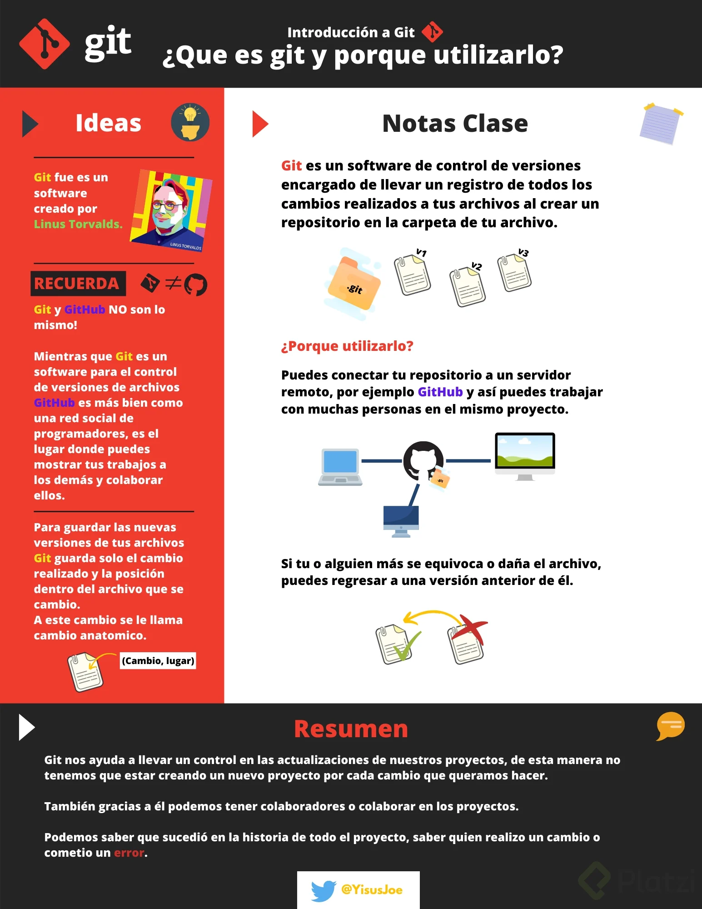


# Video 3 -  Instalando Git y GitBash en Windows

Windows y Linux tienen comandos diferentes, graban el enter de formas diferentes y tienen muchas otras diferencias. Cuando instales Git Bash en Windows debes elegir si prefieres trabajar con la forma de Windows o la forma de UNIX (Linux y Mac).

Ten en cuenta que, normalmente, los entornos de desarrollo profesionales tienen personas que usan sistemas operativos diferentes. Esto significa que, si todos podemos utilizar los mismos comandos, el trabajo resultar√° m√°s f√°cil para todos en el equipo.

Los comandos de UNIX son los más comunes entre los equipos de desarrollo. Así que, a menos que trabajes con tecnologías nativas de Microsoft (por ejemplo, .NET), la recomendación es que elijas la opción de la terminal tipo UNIX para obtener una mejor compatibilidad con todo tu equipo.

## Cómo instalar Git en Windows.

Para instalar este sistema de control de versiones en Windows, simplemente vas al repositorio de descarga. Luego de descargarlo, lo ejecutas como cualquier otra aplicación de Windows.

Al momento de iniciar el instalador, asegúrate de haber marcado la opción de instalar Git Bash en el computador (que es lo que nos permitirá correr comandos de Linux en la consola sin problemas para trabajar con Git).

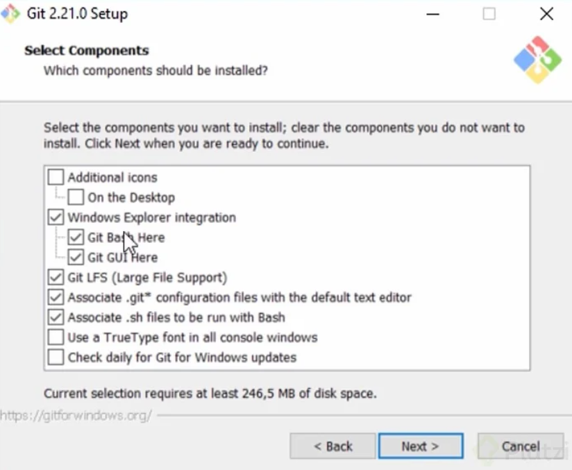

Otra forma de obtener Git fácilmente en tu computador, es descargando GitHub para Windows. Aquí puedes encontrar el instalador de GitHub.

https://desktop.github.com/

**Lecturas recomendadas**
Git - Downloads: https://git-scm.com/downloads

# Video 6 - Editores de código, archivos binarios y texto plano

Un editor de código o IDE es una herramienta que nos brinda muchas ayudas para escribir código, algo así como un bloc de notas muy avanzado. Los editores más populares son VSCode, Sublime Text y Atom, pero no es obligatorio usar alguno de estos para programar. Conoce más a fondo sobre qué es un IDE.

+ **Tipos de archivos y sus diferencias:**
    + Archivos de Texto (.txt): Texto plano normal y sin nada especial. Lo vemos igual sin importar dónde lo abramos, ya sea con el bloc de notas o con editores de texto avanzados.
    + Archivos RTF (.rtf): Podemos guardar texto con diferentes tamaños, estilos y colores. Pero si lo abrimos desde un editor de código, vamos a ver que es mucho más complejo que solo el texto plano. Esto es porque debe guardar todos los estilos del texto y, para esto, usa un código especial un poco difícil de entender y muy diferente a los textos con estilos especiales al que estamos acostumbrados.
    + Archivos de Word (.docx): Podemos guardar imágenes y texto con diferentes tamaños, estilos o colores. Al abrirlo desde un editor de código podemos ver que es código binario, muy difícil de entender y muy diferente al texto al que estamos acostumbrados. Esto es porque Word está optimizado para entender este código especial y representarlo gráficamente.
Recuerda que debes habilitar la opción de ver la extensión de los archivos, de lo contrario, solo podrás ver su nombre. La forma de hacerlo en Windows es Vista > Mostrar u ocultar > Extensiones de nombre de archivo.


### Conceptos importantes de Git
+ Bug: Error en el código

+ Repository: Donde se almacena todo el proyecto, el cual puede vivir tanto en local como en remoto. El repositorio guarda un historial de versiones y, más importante, de la relación de cada versión con la anterior para que pueda hacerse el árbol de versiones con las diferentes ramas.

+ Fork: Si en algún momento queremos contribuir al proyecto de otra persona, o si queremos utilizar el proyecto de otro como el punto de partida del nuestro. Esto se conoce como “fork”.

+ Clone: Una vez se decide hacer un fork , hasta ese momento sólo existe en GitHub. Para poder trabajar en el proyecto, toca clonar el repositorio elegido al computador personal.

+ Branch: Es una bifurcación del proyecto que se está realizando para anexar una nueva funcionalidad o corregir un bug.

+ Main: Rama donde se almacena la última versión estable del proyecto que se está realizando. La rama master es la que está en producción en cada momento (o casi) y debería estar libre de bugs. Así, si esta rama está en producción, sirve como referente para hacer nuevas funcionalidades y/o arreglar bugs de última hora.

+ Commit: consiste en subir cosas a la versión local del repositorio. De esta manera se puede trabajar en la rama de forma local sin tener que modificar ninguna versión en remoto ni tener que tener la última versión remota, cosa muy útil en grandes desarrollos trabajados por varias personas.

+ Push: Consiste en enviar todo lo que se ha confirmado con un commit al repositorio remoto. Aquí es donde se une nuestro trabajo con el de los demás.

+ Checkout: Acción de descargarse una rama del repositorio GIT local (sí, GIT tiene su propio repositorio en local para poder ir haciendo commits) o remoto.

+ Fetch: Actualiza el repositorio local bajando datos del repositorio remoto al repositorio local sin actualizarlo, es decir, se guarda una copia del repositorio remoto en el local.

+ Merge: La acción de merge es la continuación natural del fetch. El merge permite unir la copia del repositorio remoto con tu repositorio local, mezclando los diferentes códigos.

+ Pull: Consiste en la unión del fetch y del merge, esto es, recoge la información del repositorio remoto y luego mezcla el trabajo en local con esta.

+ Diff: Se utiliza para mostrar los cambios entre dos versiones del mismo archivo.

# Video 7 - Introducción a la terminal y línea de comandos


La línea de comandos nos permite interactuar con nuestro computador sin necesidad de utilizar una interfaz gráfica. Sin embargo, los computadores emplean distintos sistemas de archivos y manejan diferentes comandos, dependiendo del sistema operativo que utilicen.

## Diferencias entre la estructura de archivos de Windows, Mac o Linux.

+ La ruta principal en Windows es C:\, en UNIX es solo /.
+ Windows no hace diferencia entre mayúsculas y minúsculas pero UNIX sí.

Recuerda que GitBash usa la ruta /c para dirigirse a C:\ (o /d para dirigirse a D:\) en Windows. Por lo tanto, la ruta del usuario con el que est√°s trabajando es /c/Users/Nombre de tu usuario.

## Comandos b√°sicos en la terminal:

+ pwd: Nos muestra la ruta de carpetas en la que te encuentras ahora mismo.
+ mkdir: Nos permite crear carpetas (por ejemplo, mkdir Carpeta-Importante).
+ touch: Nos permite crear archivos (por ejemplo, touch archivo.txt).
+ rm: Nos permite borrar un archivo o carpeta (por ejemplo, rm archivo.txt). Mucho cuidado con este comando, puedes borrar todo tu disco duro.
+ cat: Ver el contenido de un archivo (por ejemplo, cat nombre-archivo.txt).
+ ls: Nos permite cambiar ver los archivos de la carpeta donde estamos ahora mismo. Podemos usar uno o más argumentos para ver más información sobre estos archivos (los argumentos pueden ser -- + el nombre del argumento o - + una sola letra o shortcut por cada argumento).
- ls -a: Mostrar todos los archivos, incluso los ocultos.
- ls -l: Ver todos los archivos como una lista.
- cd: Nos permite navegar entre carpetas.
- cd /: Ir a la ruta principal:
- cd o cd ~: Ir a la ruta de tu usuario
- cd carpeta/subcarpeta: Navegar a una ruta dentro de la carpeta donde estamos ahora mismo.
- cd .. (cd + dos puntos): Regresar una carpeta hacia atr√°s.
- Si quieres referirte al directorio en el que te encuentras ahora mismo puedes usar cd . (cd + un punto).
- history: Ver los últimos comandos que ejecutamos y un número especial con el que podemos repetir su ejecución.
- ! + n√∫mero: Ejecutar alg√∫n comando con el n√∫mero que nos muestra el comando history (por ejemplo, !72).
- clear: Para limpiar la terminal. También podemos usar los atajos de teclado Ctrl + L o Command + L.

Todos estos comandos tiene una función de autocompletado, o sea, puedes escribir la primera parte y presionar la tecla Tab para que la terminal nos muestre todas las posibles carpetas o comandos que podemos ejecutar. Si presionas la tecla Arriba puedes ver el último comando que ejecutamos.

Recuerda que podemos descubrir todos los argumentos de un comando con el argumento --help (por ejemplo, cat --help).

## ¿Qué es un Branch (rama) y cómo funciona un Merge en Git?

En GIT, una rama o branch es una versión del código del proyecto sobre el que estás trabajando. Estas ramas ayudan a mantener el orden en el control de versiones y manipular el código de forma segura.
Por defecto, el proyecto se crea en una rama llamada Main (anteriormente conocida como Master). Cada vez que añades código y guardas los cambios, estás haciendo un commit, que es añadir el nuevo código a una rama. Esto genera nuevas versiones de esta rama o branch, hasta llegar a la versión actual de la rama Main.

Cuando decides hacer experimentos, puedes generar ramas experimentales (usualmente llamadas development), que están basadas en alguna rama main, pero sobre las cuales puedes hacer cambios a tu gusto sin necesidad de afectar directamente al código principal.

En otros casos, si encuentras un bug o error de código en la rama Main (que afecta al proyecto en producción), tendrás que crear una nueva rama (que usualmente se llaman bug fixing o hot fix) para hacer los arreglos necesarios. Cuando los cambios estén listos, los tendrás que fusionar con la rama Main para que los cambios sean aplicados. Para esto, se usa un comando llamado Merge, que mezcla los cambios de la rama que originaste a la rama Main.

Todos los commits se aplican sobre una rama. Por defecto, siempre empezamos en la rama Main (pero puedes cambiarle el nombre si no te gusta) y generamos nuevas ramas, a partir de esta, para crear flujos de trabajo independientes.

## Checkout y merge
Producir una nueva rama se conoce como Checkout. Unir dos ramas lo conocemos como Merge.

Cuando haces merge de estas ramas con el código principal, su código se fusiona, originando una nueva versión de la rama Master (o main) que ya tiene todos los cambios que aplicaste en tus experimentos o arreglos de errores.

Podemos crear todas las ramas y commits que queramos. De hecho, podemos aprovechar el registro de cambios de Git para producir ramas, traer versiones viejas del código, arreglarlas y combinarlas de nuevo para mejorar el proyecto.

Solo ten en cuenta que combinar estas ramas (hacer “merge”) puede generar conflictos. Algunos archivos pueden ser diferentes en ambas ramas. Git es muy inteligente y puede intentar unir estos cambios automáticamente, pero no siempre funciona. En algunos casos, somos nosotros los que debemos resolver estos conflictos a mano.


Es muy importante tener un manejo ordenado de nuestro repositorio y para esto existe algo que se llama GitFlow.

GitFlow es una una guía que nos da cierto estándares para manejar la ramificación de nuestros proyectos, es decir, que ramas debemos tener, cuándo y de dónde debemos crear nuevas ramas, cómo debemos nombrar dichas ramas y muchos otros conceptos que nos ayudaran a manejar mucho mejor nuestro repositorio; siendo esto muy importante cuando trabajamos en conjunto con varios desarrolladores.

Algunos enlaces:
https://www.atlassian.com/git/tutorials/comparing-workflows/gitflow-workflow
https://danielkummer.github.io/git-flow-cheatsheet/

# üìπ  Video 8 - Crea un repositorio de Git y haz tu primer commit

Le indicaremos a Git que queremos crear un nuevo repositorio para utilizar su sistema de control de versiones. Solo debemos posicionarnos en la carpeta raíz de nuestro proyecto y ejecutar el comando:

```
git init
```

Recuerda que al ejecutar este comando (y de aquí en adelante) vamos a tener una nueva carpeta oculta llamada .git con toda la base de datos con cambios atómicos en nuestro proyecto.

Recuerda que Git está optimizado para trabajar en equipo, por lo tanto, debemos darle un poco de información sobre nosotros. No debemos hacerlo todas las veces que ejecutamos un comando, basta con ejecutar solo una sola vez los siguientes comandos con tu información:

```
git config --global user.email "tu@email.com"
git config --global user.name "Tu Nombre"
```

Existen muchas otras configuraciones de Git que puedes encontrar ejecutando el comando git config --list (o solo git config para ver una explicación más detallada).

Si quieres ver los archivos ocultos de una carpeta puedes habilitar la opción de Vista > Mostrar u ocultar > Elementos ocultos (en Windows) o ejecutar el comando ls -a.

## Comandos para iniciar tu repositorio con Git
- git init: para inicializar el repositorio git y el staged
- git add nombre_del_archivo.txt: enviar el archivo al staged
- git status: ver el estado, si se requiere agregar al starget o si se requiere commit
- git config: para ver las posibles configuraciones
- git config --list: para ver la lista de configuraciones hechas
- git config --list --show-origin: para mostrar las configuraciones y sus rutas
- git rm --cached nombre_del_archivo.txt: para eliminar el archivo del staged(ram)
- git rm nombre_del_archivo.txt: para eliminar del repositorio

Si por alg√∫n motivo te equivocaste en el nombre o email que configuraste al principio, lo puedes modificar de la siguiente manera:
- git config --global --replace-all user.name “Aquí va tu nombre modificado”
git config --global --add user.email “nombre@ejemplo.com”

O si lo deseas eliminar y añadir uno nuevo
- git config --global --unset-all user.name :Elimina el nombre del usuario
- git config --global --add user.name “Aquí va tu nombre”

- git log: se usa para ver la historia de nuestros archivos, los commits, el usuario que lo cambió, cuando se realizaron los cambios etc. seguidamente ponemos el nombre de nuestro archivo.

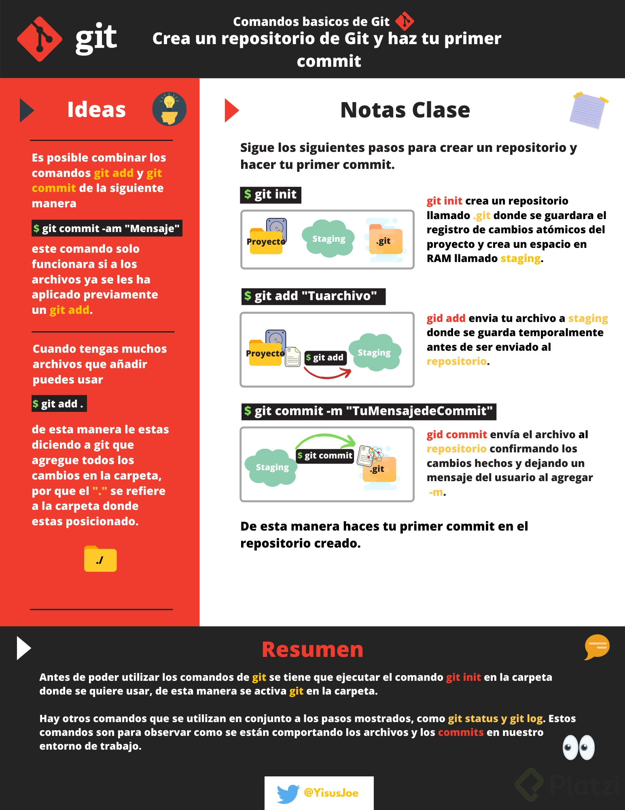
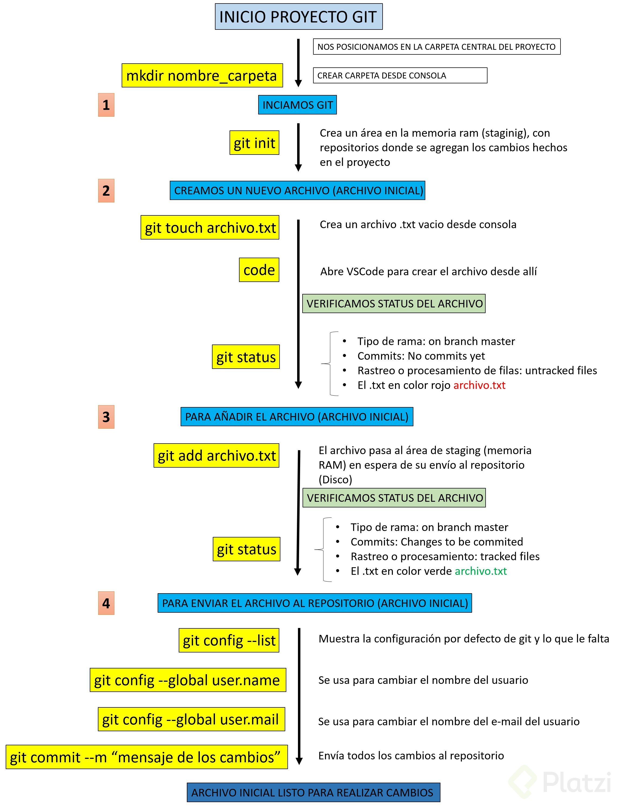

# Video 9 - Analizar cambios en los archivos de tu proyecto con Git

El comando git show nos muestra los cambios que han existido sobre un archivo y es muy útil para detectar cuándo se produjeron ciertos cambios, qué se rompió y cómo lo podemos solucionar. Pero podemos ser más detallados.

Si queremos ver la diferencia entre una versión y otra, no necesariamente todos los cambios desde la creación del archivo, podemos usar el comando git diff commitA commitB.

Recuerda que puedes obtener el ID de tus commits con el comando git log nombreArchivo.ext.
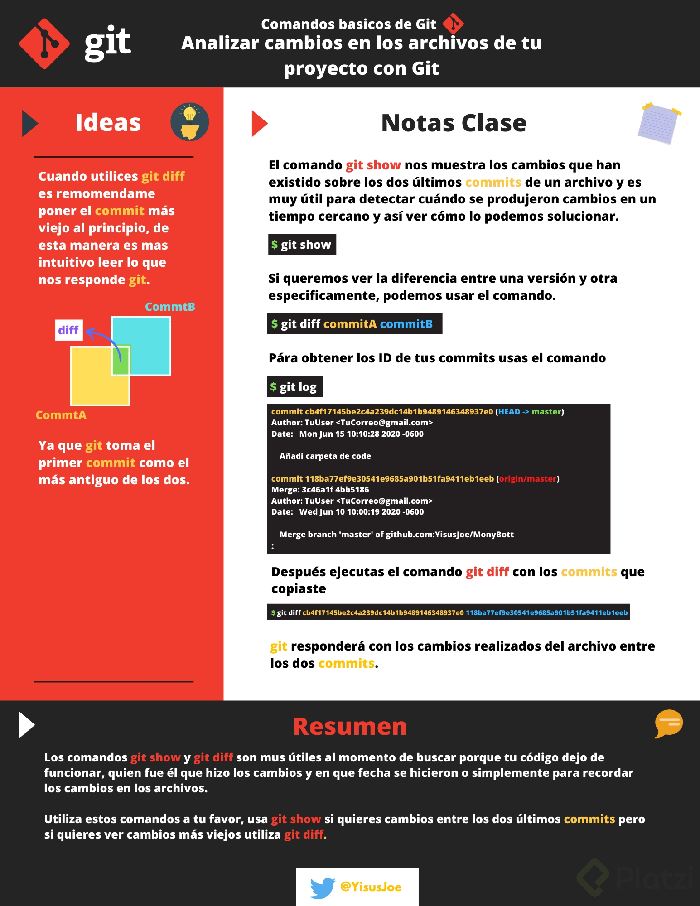

# 📹 Video 10 - ¿Qué es el staging y los repositorios? Ciclo básico de trabajo en Git.

🗒️ Para iniciar un repositorio, o sea, activar el sistema de control de versiones de Git en tu proyecto, solo debes ejecutar el comando ***git init*** 🔦.

Este comando se encargará de dos cosas: primero, crear una carpeta .git, donde se guardará toda la base de datos con cambios atómicos de nuestro proyecto; y segundo, crear un área que conocemos como Staging, que guardará temporalmente nuestros archivos (cuando ejecutemos un comando especial para eso) y nos permitirá, más adelante, guardar estos cambios en el repositorio (también con un comando especial).

## ❤️ Ciclo de vida o estados de los archivos en Git:

+ 🗒️Cuando trabajamos con Git nuestros archivos pueden vivir y moverse entre 4 diferentes estados (cuando trabajamos con repositorios remotos pueden ser más estados, pero lo estudiaremos más adelante):

    + **Archivos Tracked:** son los archivos que viven dentro de Git, no tienen cambios pendientes y sus √∫ltimas actualizaciones han sido guardadas en el repositorio gracias a los comandos git add y git commit.
    + **Archivos Staged:** son archivos en Staging. Viven dentro de Git y hay registro de ellos porque han sido afectados por el comando git add, aunque no sus últimos cambios. Git ya sabe de la existencia de estos últimos cambios, pero todavía no han sido guardados definitivamente en el repositorio porque falta ejecutar el comando ***git commit***.
    + **Archivos Unstaged:** entiéndelos como archivos “Tracked pero Unstaged”. Son archivos que viven dentro de Git pero no han sido afectados por el comando git add ni mucho menos por git commit. Git tiene un registro de estos archivos, pero está desactualizado, sus últimas versiones solo están guardadas en el disco duro.
    + **Archivos Untracked:** son archivos que NO viven dentro de Git, solo en el disco duro. Nunca han sido afectados por git add, así que Git no tiene registros de su existencia.

Recuerda que hay un caso muy raro donde los archivos tienen dos estados al mismo tiempo: staged y untracked. Esto pasa cuando guardas los cambios de un archivo en el área de Staging (con el comando git add), pero antes de hacer commit para guardar los cambios en el repositorio haces nuevos cambios que todavía no han sido guardados en el área de Staging (en realidad, todo sigue funcionando igual pero es un poco divertido).

## ❤️ Comandos para mover archivos entre los estados de Git:
+ 
    + **git status:** nos permite ver el estado de todos nuestros archivos y carpetas.
    + **git add:** nos ayuda a mover archivos del Untracked o Unstaged al estado Staged. Podemos usar git nombre-del-archivo-o-carpeta para añadir archivos y carpetas individuales o git add -A para mover todos los archivos de nuestro proyecto (tanto Untrackeds como unstageds).
    + **git reset HEAD:** nos ayuda a sacar archivos del estado Staged para devolverlos a su estado anterior. Si los archivos venían de Unstaged, vuelven allí. Y lo mismo se venían de Untracked.
    + **git commit:** nos ayuda a mover archivos de Unstaged a Tracked. Esta es una ocasión especial, los archivos han sido guardados o actualizados en el repositorio. Git nos pedirá que dejemos un mensaje para recordar los cambios que hicimos y podemos usar el argumento -m para escribirlo (git commit -m "mensaje").
    + **git rm:** este comando necesita alguno de los siguientes argumentos para poder ejecutarse correctamente:
        - git rm --cached: Mueve los archivos que le indiquemos al estado Untracked.
        - git rm --force: Elimina los archivos de Git y del disco duro. Git guarda el registro de la existencia de los archivos, por lo que podremos recuperarlos si es necesario (pero debemos usar comandos m√°s avanzados).


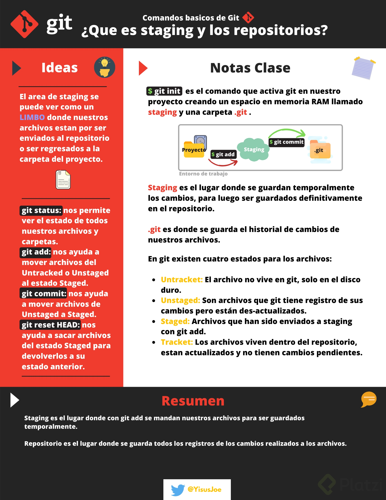

# 📹 Video 11 -  ¿Qué es un Branch (rama) y cómo funciona un Merge en Git?

🗒️ En GIT, una rama o branch es una versión del código del proyecto sobre el que estás trabajando. Estas ramas ayudan a mantener el orden en el control de versiones y manipular el código de forma segura.
Por defecto, el proyecto se crea en una rama llamada Main (anteriormente conocida como Master). Cada vez que añades código y guardas los cambios, estás haciendo un commit, que es añadir el nuevo código a una rama. Esto genera nuevas versiones de esta rama o branch, hasta llegar a la versión actual de la rama Main.

Cuando decides hacer experimentos, puedes generar ramas experimentales (usualmente llamadas development), que están basadas en alguna rama main, pero sobre las cuales puedes hacer cambios a tu gusto sin necesidad de afectar directamente al código principal.

En otros casos, si encuentras un bug o error de código en la rama Main (que afecta al proyecto en producción), tendrás que crear una nueva rama (que usualmente se llaman bug fixing o hot fix) para hacer los arreglos necesarios. Cuando los cambios estén listos, los tendrás que fusionar con la rama Main para que los cambios sean aplicados. Para esto, se usa un comando llamado Merge, que mezcla los cambios de la rama que originaste a la rama Main.

Todos los commits se aplican sobre una rama. Por defecto, siempre empezamos en la rama Main (pero puedes cambiarle el nombre si no te gusta) y generamos nuevas ramas, a partir de esta, para crear flujos de trabajo independientes.

## Checkout y merge

🗒️ Producir una nueva rama se conoce como Checkout. Unir dos ramas lo conocemos como Merge.

Cuando haces merge de estas ramas con el código principal, su código se fusiona, originando una nueva versión de la rama Master (o main) que ya tiene todos los cambios que aplicaste en tus experimentos o arreglos de errores.

Podemos generar todas las ramas y commits que queramos. De hecho, podemos aprovechar el registro de cambios de Git para producir ramas, traer versiones viejas del código, arreglarlas y combinarlas de nuevo para mejorar el proyecto.

Solo ten en cuenta que combinar estas ramas (hacer “merge”) puede generar conflictos. Algunos archivos pueden ser diferentes en ambas ramas. Git es muy inteligente y puede intentar unir estos cambios automáticamente, pero no siempre funciona. En algunos casos, somos nosotros los que debemos resolver estos conflictos a mano.

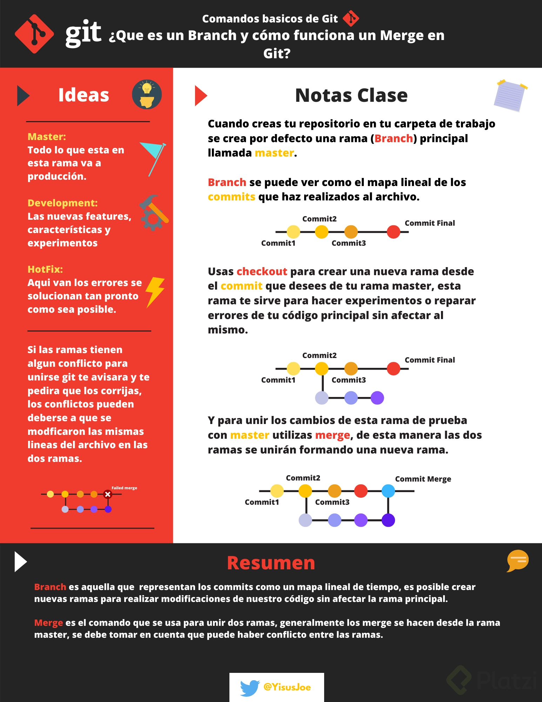
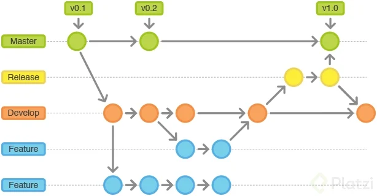
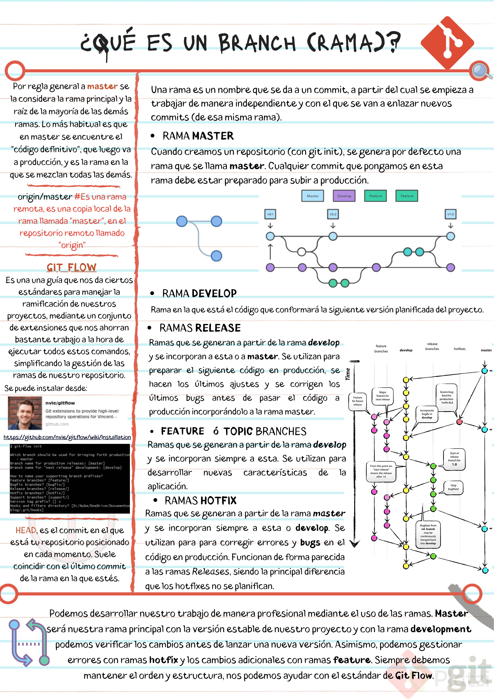

# üìπ Video 12 - Volver en el tiempo en nuestro repositorio utilizando reset y checkout.

🗒️ El comando git checkout + ID del commit nos permite viajar en el tiempo. Podemos volver a cualquier versión anterior de un archivo específico o incluso del proyecto entero. Esta también es la forma de crear ramas y movernos entre ellas.

También hay una forma de hacerlo un poco más “ruda”: usando el comando git reset. En este caso, no solo “volvemos en el tiempo”, sino que borramos los cambios que hicimos después de este commit.

Hay dos formas de usar git reset: con el argumento --hard, borrando toda la información que tengamos en el área de staging (y perdiendo todo para siempre). O, un poco más seguro, con el argumento --soft, que mantiene allí los archivos del área de staging para que podamos aplicar nuestros últimos cambios pero desde un commit anterior.

## Cómo usar Git Reset

+ Para volver a commits previos, borrando los cambios realizados desde ese commit, podemos utilizar:
    + git reset --soft [SHA 1]: elimina los cambios hasta el staging area
    + git reset --mixed [SHA 1]: elimina los cambios hasta el working area
    + git reset --hard [SHA 1]: regresa hasta el commit del [SHA-1]. Donde el SHA-1 es el identificador del commit

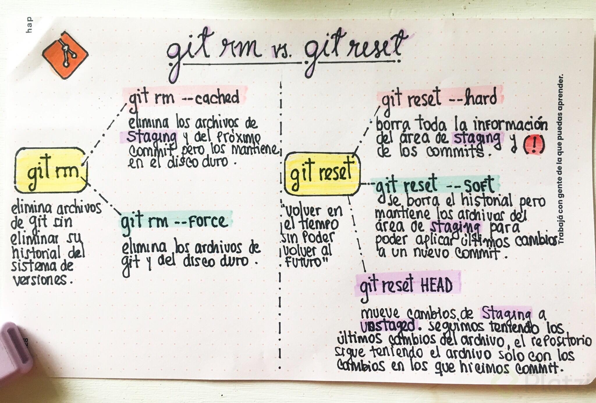

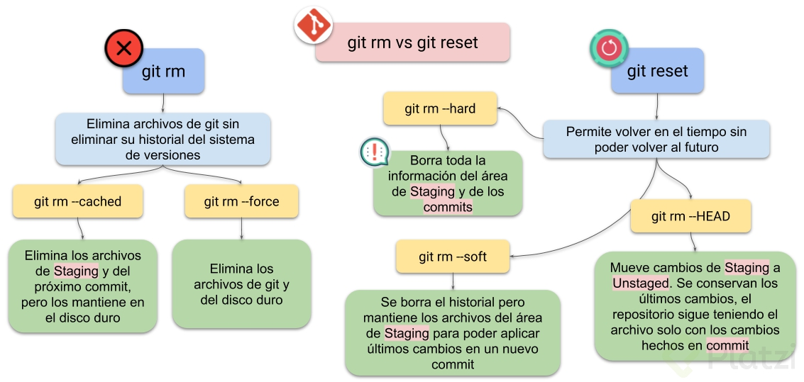 


# üìπ Video 13 - Git reset vs. Git rm

Git reset y git rm son comandos con utilidades muy diferentes, pero se pueden confundir muy f√°cilmente.

## git rm ❤️

🗒️Este comando nos ayuda a eliminar archivos de Git sin eliminar su historial del sistema de versiones. Esto quiere decir que si necesitamos recuperar el archivo solo debemos “viajar en el tiempo” y recuperar el último commit antes de borrar el archivo en cuestión.

Recuerda que **git rm** no puede usarse así nomás. Debemos usar uno de los flags para indicarle a Git cómo eliminar los archivos que ya no necesitamos en la última versión del proyecto:
+ git rm --cached: Elimina los archivos de nuestro repositorio local y del √°rea de staging, pero los mantiene en nuestro disco duro. B√°sicamente le dice a Git que deje de trackear el historial de cambios de estos archivos, por lo que pasaran a un estado untracked.
+ git rm --force: Elimina los archivos de Git y del disco duro. Git siempre guarda todo, por lo que podemos acceder al registro de la existencia de los archivos, de modo que podremos recuperarlos si es necesario (pero debemos usar comandos m√°s avanzados).


## git reset ❤️

Este comando nos ayuda a volver en el tiempo. Pero no como git checkout que nos deja ir, mirar, pasear y volver. Con git reset volvemos al pasado sin la posibilidad de volver al futuro. Borramos la historia y la debemos sobreescribir. No hay vuelta atr√°s.

Este comando es muy peligroso y debemos emplearlo solo en caso de emergencia. Recuerda que debemos usar alguna de estas dos opciones:
+ Hay dos formas de utilizar git reset: 
    + Con el argumento --hard, borrando toda la información que tengamos en el área de staging (y perdiendo todo para siempre). 
    + O, un poco más seguro, con el argumento --soft, que mantiene allí los archivos del área de staging para que podamos aplicar nuestros últimos cambios pero desde un commit anterior.

+ **git reset --soft:** Borramos todo el historial y los registros de Git pero guardamos los cambios que tengamos en Staging, así podemos aplicar las últimas actualizaciones a un nuevo commit.
+ **git reset --hard:** Borra todo. Todo todito, absolutamente todo. Toda la información de los commits y del área de staging se borra del historial.

## Pero todavía falta algo!

+ **git reset HEAD:** Este es el comando para sacar archivos del área de staging. No para borrarlos ni nada de eso, solo para que los últimos cambios de estos archivos no se envíen al último commit, a menos que cambiemos de opinión y los incluyamos de nuevo en staging con git add, por supuesto.

## ¿Por qué esto es importante?

**Imagina el siguiente caso:**

Hacemos cambios en los archivos de un proyecto para una nueva actualización. Todos los archivos con cambios se mueven al área de staging con el comando git add. Pero te das cuenta de que uno de esos archivos no está listo todavía. Actualizaste el archivo, pero ese cambio no debe ir en el próximo commit por ahora.

**¿Qué podemos hacer?**

🗒️ Bueno, todos los cambios están en el área de Staging, incluido el archivo con los cambios que no están listos. Esto significa que debemos sacar ese archivo de Staging para poder hacer commit de todos los demás.

¡Al usar git rm lo que haremos será eliminar este archivo completamente de git! Todavía tendremos el historial de cambios de este archivo, con la eliminación del archivo como su última actualización. Recuerda que en este caso no buscábamos eliminar un archivo, solo dejarlo como estaba y actualizarlo después, no en este commit.

En cambio, si usamos git reset HEAD, lo único que haremos será mover estos cambios de Staging a Unstaged. Seguiremos teniendo los últimos cambios del archivo, el repositorio mantendrá el archivo (no con sus últimos cambios, pero sí con los últimos en los que hicimos commit) y no habremos perdido nada.

Conclusión: Lo mejor que puedes hacer para salvar tu puesto y evitar un incendio en tu trabajo es conocer muy bien la diferencia y los riesgos de todos los comandos de Git.

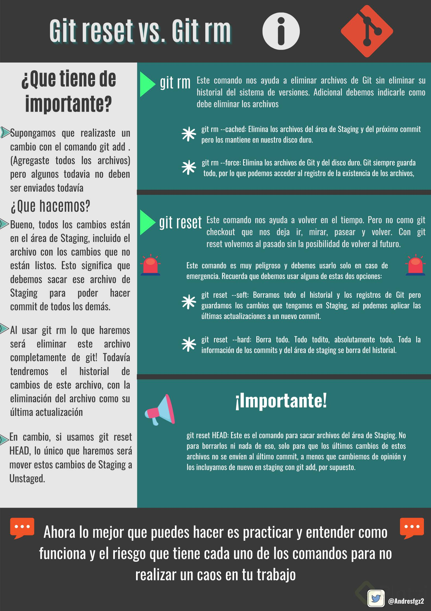


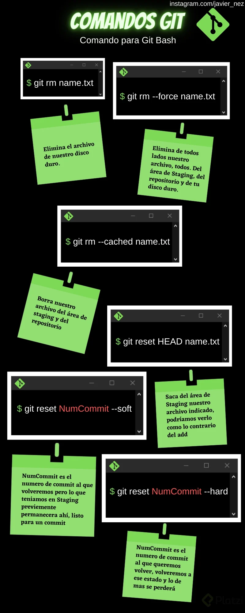

# üìπ Video 14 - Flujo de trabajo b√°sico con un repositorio remoto.

🗒️ Cuando empiezas a trabajar en un entorno local, el proyecto vive únicamente en tu computadora. Esto significa que no hay forma de que otros miembros del equipo trabajen en él.

Para solucionar esto, utilizamos los servidores remotos: un nuevo estado que deben seguir nuestros archivos para conectarse y trabajar con equipos de cualquier parte del mundo.

Estos servidores remotos pueden estar alojados en **GitHub, GitLab, BitBucket**, entre otros. Lo que van a hacer es guardar el mismo repositorio que tienes en tu computadora y darnos una URL con la que todos podremos acceder a los archivos del proyecto. Así, el equipo podrá descargarlos, hacer cambios y volverlos a enviar al servidor remoto para que otras personas vean los cambios, comparen sus versiones y creen nuevas propuestas para el proyecto.

Esto significa que debes aprender algunos nuevos comandos

+ Comandos para trabajo remoto con GIT: 👀
    + **git clone url_del_servidor_remoto**: Nos permite descargar los archivos de la última versión de la rama principal y todo el historial de cambios en la carpeta .git.
    + **git push**: Luego de hacer git add y git commit debemos ejecutar este comando para mandar los cambios al servidor remoto. ❤️
    + **git fetch**: Lo usamos para traer actualizaciones del servidor remoto y guardarlas en nuestro repositorio local (en caso de que hayan, por supuesto). ❤️
    + **git merge**: También usamos el comando git merge con servidores remotos. Lo necesitamos para combinar los últimos cambios del servidor remoto y nuestro directorio de trabajo.
    + **git pull**: Básicamente, git fetch y git merge al mismo tiempo. ❤️

+ Adicionalmente, tenemos otros comandos que nos sirven para trabajar en proyectos muy grandes:
    + **git log --oneline**:Te muestra el id commit y el título del commit.
    + **git log --decorate**: Te muestra donde se encuentra el head point en el log.
    + **git log --stat**: Explica el número de líneas que se cambiaron brevemente. ❤️👀
    + **git log -p**: Explica el número de líneas que se cambiaron y te muestra que se cambió en el contenido.
    + **git shortlog**: Indica que commits ha realizado un usuario, mostrando el usuario y el título de sus commits.
    + **git log --graph --oneline --decorate** y
    + **git log --pretty=format**:"%cn hizo un commit %h el dia %cd": Muestra mensajes personalizados de los commits.
    + **git log -3**: Limitamos el n√∫mero de commits.
    + **git log --after=“2018-1-2”**
    + git log --after=“today” y
    + **git log --after=“2018-1-2” --before=“today”**: Commits para localizar por fechas.
    + **git log --author=“Name Author”**: Commits hechos por autor que cumplan exactamente con el nombre.
    + **git log --grep=“INVIE”**: Busca los commits que cumplan tal cual está escrito entre las comillas.
    + **git log --grep=“INVIE” –i**: Busca los commits que cumplan sin importar mayúsculas o minúsculas.
    + **git log – index.html**: Busca los commits en un archivo en específico.
    + **git log -S “Por contenido”**: Buscar los commits con el contenido dentro del archivo.
    + ***git log > log.txt: guardar los logs en un archivo txt*** 👀👌❤️


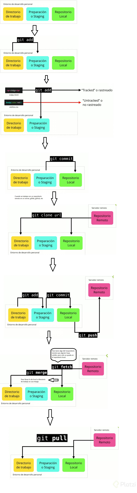

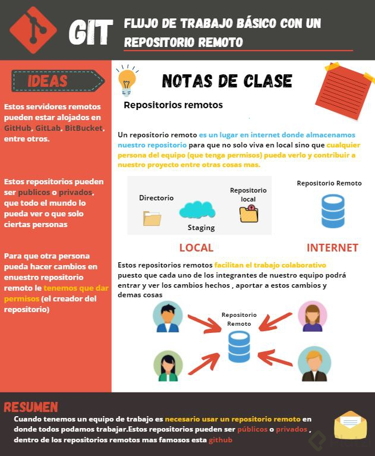

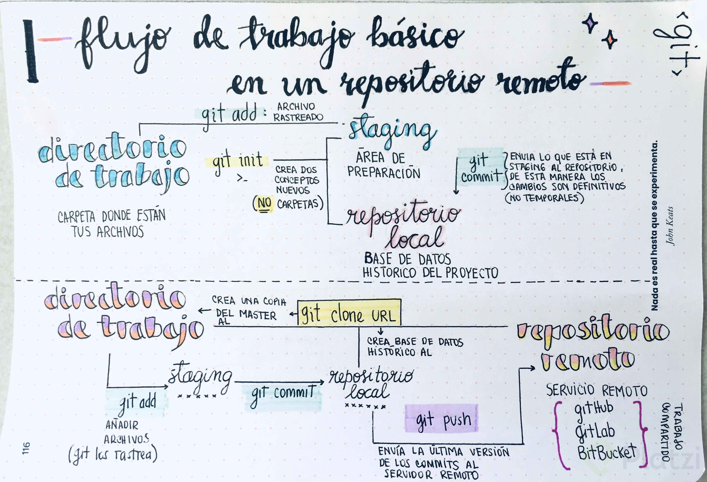

# 📹 Video 15 - Introducción a las ramas o branches de Git.

🗒️ Las ramas son la forma de hacer cambios en nuestro proyecto sin afectar el flujo de trabajo de la rama principal. Esto porque queremos trabajar una parte muy específica de la aplicación o simplemente experimentar.

La cabecera o HEAD representan la rama y el commit de esa rama donde estamos trabajando. Por defecto, esta cabecera aparecer√° en el √∫ltimo commit de nuestra rama principal. Pero podemos cambiarlo al crear una rama (git branch rama, git checkout -b rama) o movernos en el tiempo a cualquier otro commit de cualquier otra rama con los comandos (git reset id-commit, git checkout rama-o-id-commit).

+ **git add -am "aquí el mensaje"**: Es una mezcla entre **git add** y git commit. Solo funciona si al archivo se le ha hecho previamente un **git add**. 👀❤️🔦👌

## Cómo funcionan las ramas en GIT

🗒️ Las ramas son la manera de hacer cambios en nuestro proyecto sin afectar el flujo de trabajo de la rama principal. Esto porque queremos trabajar una parte muy específica de la aplicación o simplemente experimentar.

+ **git branch -nombre de la rama-**: Con este comando se genera una nueva rama.
+ **git checkout -nombre de la rama-**: Con este comando puedes saltar de una rama a otra.
+ **git checkout -b rama**: Genera una rama y nos mueve a ella automáticamente, Es decir, es la combinación de git brach y git checkout al mismo tiempo. 👀❤️🔦👌
+ **git reset id-commit**: Nos lleva a cualquier commit no importa la rama, ya que identificamos el id del tag., eliminando el historial de los commit posteriores al tag seleccionado. ☣️⚡
+ **git checkout rama-o-id-commit**: Nos lleva a cualquier commit sin borrar los commit posteriores al tag seleccionado.

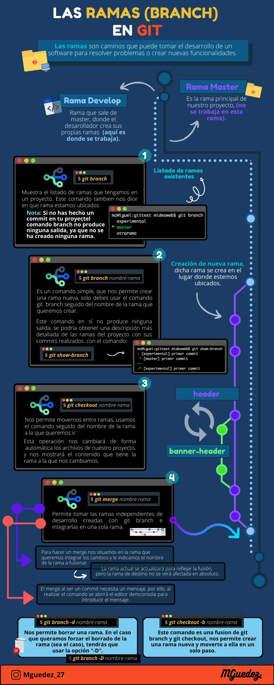

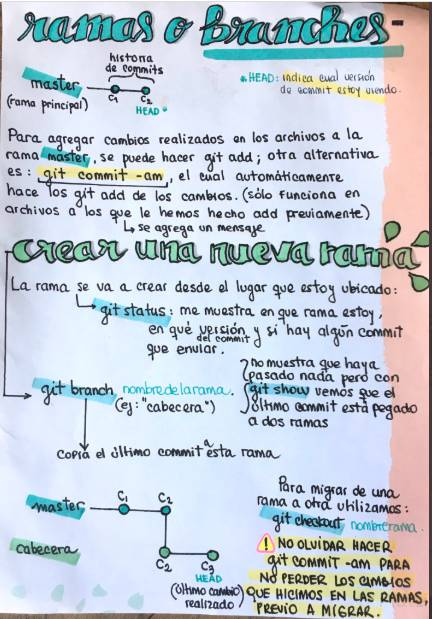

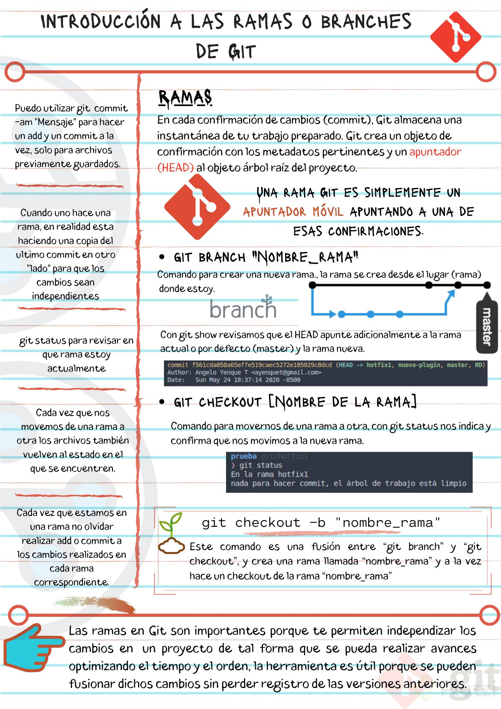

# 📹 Video 16 - Fusión de ramas con Git merge

🗒️ El comando git merge nos permite crear un nuevo commit con la combinación de dos ramas (la rama donde nos encontramos cuando ejecutamos el comando y la rama que indiquemos después del comando).

```
    # Crear un nuevo commit en la rama master combinando
    # los cambios de la rama cabecera:
    git checkout master
    git merge cabecera


    # Crear un nuevo commit en la rama cabecera combinando
    # los cambios de cualquier otra rama:
    git checkout cabecera
    git merge cualquier-otra-rama
```

Asombroso, ¿verdad? Es como si Git tuviera super poderes para saber qué cambios queremos conservar de una rama y qué otros de la otra. El problema es que no siempre puede adivinar, sobretodo en algunos casos donde dos ramas tienen actualizaciones diferentes en ciertas líneas en los archivos. Esto lo conocemos como un conflicto y aprenderemos a solucionarlos en la siguiente clase.

Recuerda que al ejecutar el comando git checkout para cambiar de rama o commit puedes perder el trabajo que no hayas guardado. Guarda tus cambios antes de hacer git checkout.

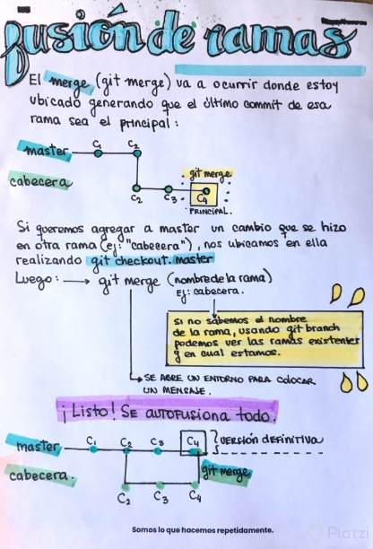

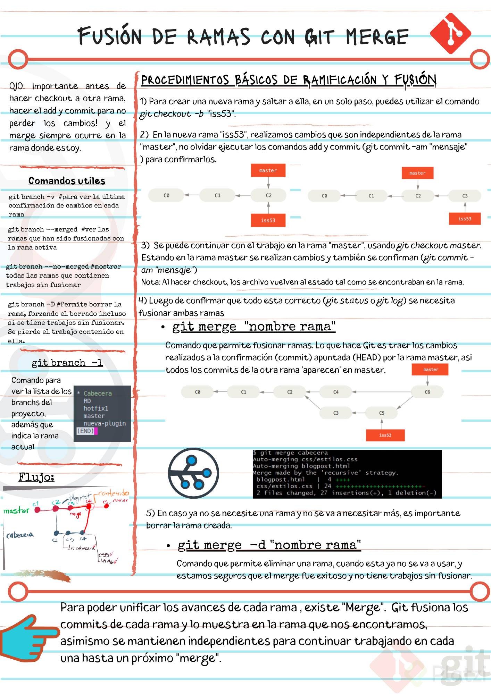

# 📹 Video 17 - Resolución de conflictos al hacer un merge

Git nunca borra nada, a menos que nosotros se lo indiquemos. Cuando usamos los comandos `git merge` o `git checkout` estamos cambiando de rama o creando un nuevo commit, no borrando ramas ni commits (recuerda que puedes borrar commits con git reset y ramas con git branch -d).

Git es muy inteligente y puede resolver algunos conflictos automáticamente: cambios, nuevas líneas, entre otros. Pero algunas veces no sabe cómo resolver estas diferencias, por ejemplo, cuando dos ramas diferentes hacen cambios distintos a una misma línea.

Esto lo conocemos como conflicto y lo podemos resolver manualmente. Solo debemos hacer el merge, ir a nuestro editor de código y elegir si queremos quedarnos con alguna de estas dos versiones o algo diferente. Algunos editores de código como Visual Studio Code nos ayudan a resolver estos conflictos sin necesidad de borrar o escribir líneas de texto, basta con hacer clic en un botón y guardar el archivo.

Recuerda que siempre debemos crear un nuevo commit para aplicar los cambios del merge. Si Git puede resolver el conflicto, har√° commit autom√°ticamente. Pero, en caso de no pueda resolverlo, debemos solucionarlo y hacer el commit.

Los archivos con conflictos por el comando git merge entran en un nuevo estado que conocemos como Unmerged. Funcionan muy parecido a los archivos en estado Unstaged, algo así como un estado intermedio entre Untracked y Unstaged. Solo debemos ejecutar git add para pasarlos al área de staging y git commit para aplicar los cambios en el repositorio.

## Cómo revertir un merge

Si nos hemos equivocado y queremos cancelar el merge, debemos usar el siguiente comando:

```
    git merge --abort
```

## Conflictos en repositorios remotos

Al trabajar con otras personas, es necesario utilizar un repositorio remoto.
­
+ Para copiar el repositorio remoto al directorio de trabajo local, se utiliza el comando `git clone <url>`, y para enviar cambios al repositorio remoto se utiliza `git push`.
+ Para actualizar el repositorio local se hace uso del comando `git fetch`, luego se debe fusionar los datos traídos con los locales usando git merge.

+ Para traer los datos y fusionarlos a la vez, en un solo comando, se usa `git pull`.
+ Para crear commits r√°pidamente, fusionando git add y git commit -m "", usamos `git commit -am` "".
+ Para generar nuevas ramas, hay que posicionarse sobre la rama que se desea copiar y       utilizar el comando `git branch <nombre>`.
+ Para saltar entre ramas, se usa el comando `git checkout <branch>`.
­
+ Una vez realizado los cambios en la rama, estas deben fusionarse con `git merge`.
    + El merge ocurre en la rama en la que se est√° posicionado. Por lo tanto, la rama a fusionar se transforma en la principal.
    + Los merges también son commits.
    + Los merges pueden generar conflictos, esto aborta la acción y pide que soluciones el problema manualmente, aceptando o rechazando los cambios que vienen.

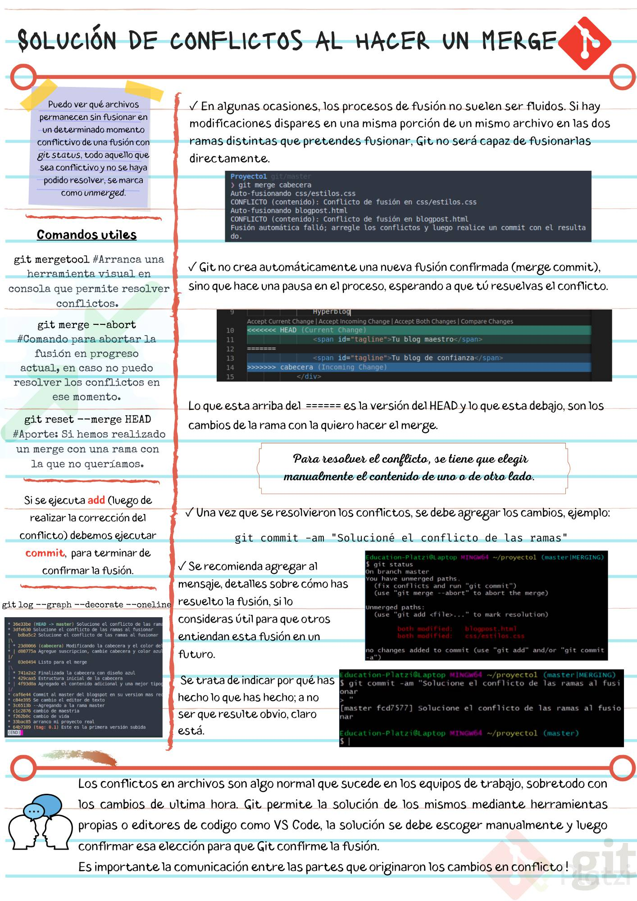

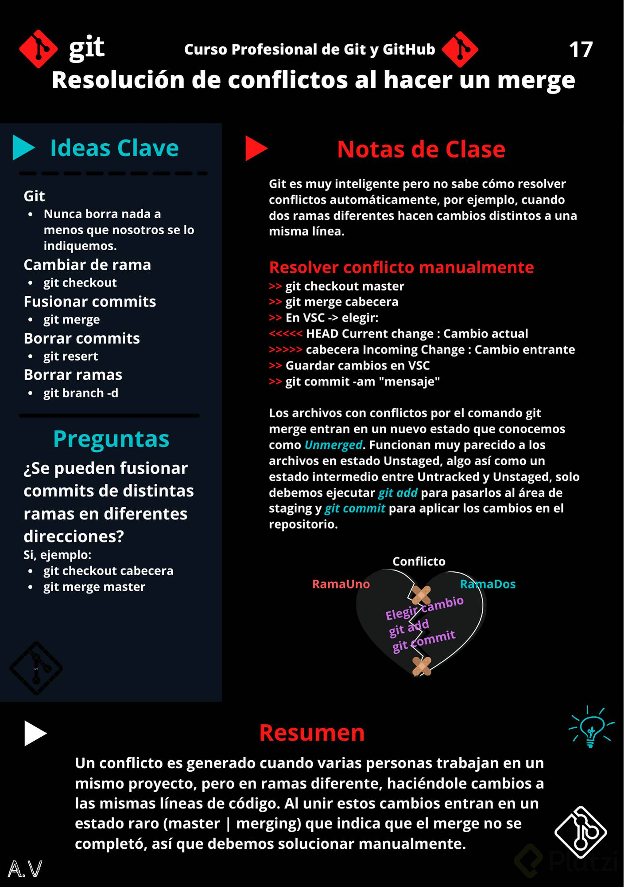

# üìπ Video 18 - Cambios en GitHub: de master a main

El escritor Argentino Julio Cortázar afirma que las palabras tienen color y peso. Por otro lado, los sinónimos existen por definición, pero no expresan lo mismo. Feo no es lo mismo que desagradable, ni aromático es lo mismo que oloroso.

Por lo anterior podemos afirmar que los sinónimos no expresan lo mismo, no tienen el mismo “color” ni el mismo “peso”.

Sí, esta lectura es parte del curso profesional de Git & GitHub. Quédate conmigo.

Desde el 1 de octubre de 2020 GitHub cambió el nombre de la rama principal: ya no es “master” -como aprenderás en el curso- sino main.

Este derivado de una profunda reflexión ocasionada por el movimiento #BlackLivesMatter.

La industria de la tecnología lleva muchos años usando términos como master, slave, blacklist o whitelist y esperamos pronto puedan ir desapareciendo.

Y sí, las palabras importan.

Por lo que de aquí en adelante cada vez que escuches a Freddy mencionar “master” debes saber que hace referencia a “main”

# üìπ Video 19 - Uso de GitHub

🗒️ `GitHub` es una plataforma que nos permite guardar repositorios de Git que podemos usar como servidores remotos y ejecutar algunos comandos de forma visual e interactiva (sin necesidad de la consola de comandos).

Luego de crear nuestra cuenta, podemos crear o importar repositorios, crear organizaciones y proyectos de trabajo, descubrir repositorios de otras personas, contribuir a esos proyectos, dar estrellas y muchas otras cosas.

El `README.md` es el archivo que veremos por defecto al entrar a un repositorio. Es una muy buena pr√°ctica configurarlo para describir el proyecto, los requerimientos y las instrucciones que debemos seguir para contribuir correctamente.

Para clonar un repositorio desde GitHub (o cualquier otro servidor remoto) debemos copiar la URL (por ahora, usando HTTPS) y ejecutar el comando `git clone + la URL` que acabamos de copiar. Esto descargará la versión de nuestro proyecto que se encuentra en GitHub.

Sin embargo, esto solo funciona para las personas que quieren empezar a contribuir en el proyecto.

## Cómo conectar un repositorio de Github a nuestro documento local

+ Si queremos conectar üîå el repositorio de `GitHub` con nuestro repositorio local, que creamos usando el comando `git init`, debemos ejecutar las siguientes instrucciones:
    + Guardar la URL del repositorio de GitHub con el nombre de origin
    ```
        git remote add origin URL
    ```
    + Verificar que la URL se haya guardado correctamente:
    ```
        git remote
        git remote -v
    ```
    + Traer la versión del repositorio remoto y hacer merge para crear un commit con los archivos de ambas partes. Podemos usar `git fetch` y `git merge` o solo `git pull` con el flag `--allow-unrelated-histories`:
    ```
        git pull origin main --allow-unrelated-histories
    ```
    + Por último, ahora sí podemos hacer git push para guardar los cambios de nuestro repositorio local en GitHub:
     ```
        git push origin master:main
     ```

**PD:**

Muchahos, a tener en cuenta:
GitHub en Octubre 2020 decide llamar la rama ‘master’ a rama ‘main’, lo que significa que en cuanto ha la clase han ocurrido unos cambios.

Al ejecutar el comando:


    ```
    git push origin master
    ```

Estamos diciéndole a git que envíe a origin(remoto) la rama ‘master’ de nuestro repositorio local. Por lo tanto, en GitHub se interpreta como adicionar una rama independiente llamada ‘master’ con su contenido a bordo, pero no se carga en la rama default de GitHub, debido a que su rama default ahora se llama ‘main’.
Para alinear el contenido de Freedy y la actualización de GitHub, en la practica el comando para realizar el push según el nuevo estándar seria:

    ```
    git push origin master:main
    ```

En donde le estamos diciéndole a git que envíe a origin(remoto) la rama ‘master’ de nuestro repositorio local hasta la rama ‘main’ del servidor remoto. De igual manera, dentro de esta nueva lógica:

    ```
    git pull origin main --allow-unrelated-histories
    ```

En donde estamos trayendo desde el servidor remoto la rama ‘main’ fusionando las historias.
De tal manera que ya podemos continuar con el contenido de Freddy sin llegar a confundirnos.

     ```
     Si a ustedes no les sale el mensaje de que se tiene que traer los cambios y al intentar hacer el pull les dice que todo está actualizado es porque GitHub cambió su rama por defecto a “main” y nosotros estamos trabajando con la rama master, por tanto GitHub lo está tomando como un pull request (Porque son diferentes ramas)

    Para seguir esta clase deben borrar el repositorio en GitHub (Si ya lo tenían creado) y configurar su rama por defecto como master en:

    https://github.com/settings/repositories

    En el apartado “Repository default branch” borran main y escriben “master” y le dan al botón de actualizar, después vuelven a crear su repositorio “hyperblog” en GitHub y continuan la clase normal

     ```

# 📹 Video 20 - Cómo funcionan las llaves públicas y privadas

Las llaves públicas y privadas, conocidas también como cifrado asimétrico de un solo camino, sirven para mandar mensajes privados entre varios nodos con la lógica de que firmas tu mensaje con una llave pública vinculada con una llave privada que puede leer el mensaje.

Las llaves p√∫blicas y privadas nos ayudan a cifrar y descifrar nuestros archivos de forma que los podamos compartir sin correr el riesgo de que sean interceptados por personas con malas intenciones.

+ Cómo funciona un mensaje cifrado con llaves públicas y privadas:
    + Ambas personas deben crear su llave p√∫blica y privada.
    + Ambas personas pueden compartir su llave pública a las otras partes (recuerda que esta llave es pública, no hay problema si la “interceptan”).
    + La persona que quiere compartir un mensaje puede usar la llave p√∫blica de la otra persona para cifrar los archivos y asegurarse que solo puedan ser descifrados con la llave privada de la persona con la que queremos compartir el mensaje.
    + El mensaje est√° cifrado y puede ser enviado a la otra persona sin problemas en caso de que los archivos sean interceptados.
    + La persona a la que enviamos el mensaje cifrado puede emplear su llave privada para descifrar el mensaje y ver los archivos.

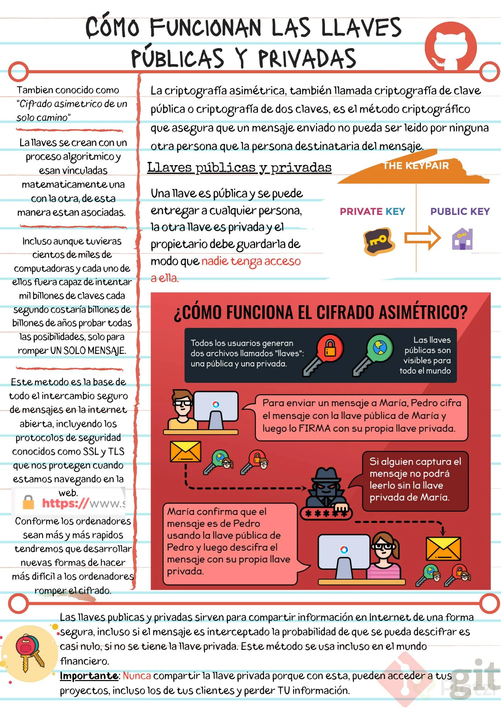

# üìπ Video 21 - Configura tus llaves SSH en local


`Generar una nueva llave SSH: (Cualquier sistema operativo)`

    ```
    ssh-keygen -t rsa -b 4096 -C "youremail@example.com"
    ```

`Comprobar proceso y agregarlo (Windows)`

  ```
    eval $(ssh-agent - s)
    ssh-add ~/.ssh/id_rsa
  ```

`Comprobar proceso y agregarlo (Mac)`
 
  ```
    eval "$(ssh-agent -s)"
  ```

`¬øUsas macOS Sierra 10.12.2 o superior?`

`Haz lo siguiente:`

  ```
    cd ~/.ssh
    Crea un archivo config…
    Con Vim vim config
    Con VSCode code config
    Pega la siguiente configuración en el archivo…
  ```
 ```
    Host *
    AddKeysToAgent yes
    UseKeychain yes
    IdentityFile ~/.ssh/id_rsa
 ```

`Agrega tu llave en Mac`
    
    ```
    ssh-add -K ~/.ssh/id_rsa
    ```

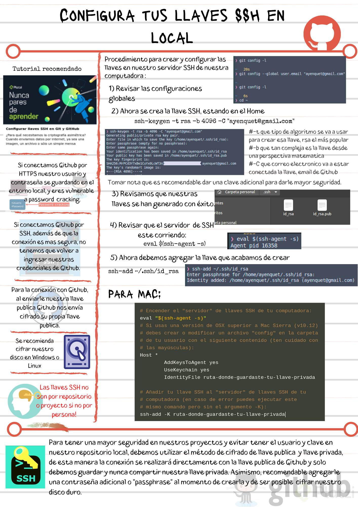

# 📹 Video 22 - Conexión a GitHub con SSH

🗒️La creación de las SSH es necesario solo una vez por cada computadora. Aquí conocerás cómo conectar a GitHub usando SSH.

Luego de crear nuestras llaves SSH podemos entregarle la llave pública a GitHub para comunicarnos de forma segura y sin necesidad de escribir nuestro usuario y contraseña todo el tiempo.

Para esto debes entrar a la Configuración de Llaves SSH en GitHub, crear una nueva llave con el nombre que le quieras dar y el contenido de la llave pública de tu computadora.

Ahora podemos actualizar la URL que guardamos en nuestro repositorio remoto, solo que, en vez de guardar la URL con HTTPS, vamos a usar la URL con SSH:

```
    ssh
    git remote set-url origin url-ssh-del-repositorio-en-github
```

## Comandos para copiar la llave SSH:

+ Mac:

```
    pbcopy < ~/.ssh/id_rsa.pub
```

+ Windows (Git Bash):

```
    clip < ~/.ssh/id_rsa.pub
```

+ Linux (Ubuntu):

```
    cat ~/.ssh/id_rsa.pub
```


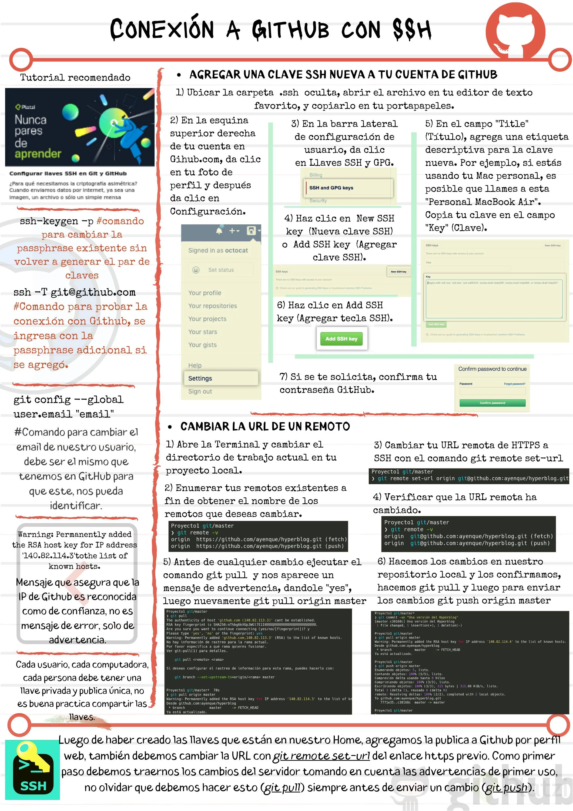

# üìπ video 23 - Tags y versiones en Git y GitHub

Los tags o etiquetas nos permiten asignar versiones a los commits con cambios m√°s importantes o significativos de nuestro proyecto.

## Comandos para trabajar con etiquetas:

+ Crear un nuevo tag y asignarlo a un commit: `git tag -a nombre-del-tag id-del-commit.`
+ Borrar un tag en el repositorio local: `git tag -d nombre-del-tag`.
+ Listar los tags de nuestro repositorio local: `git tag o git show-ref --tags`.
+ Publicar un tag en el repositorio remoto: `git push origin --tags`.
+ Borrar un tag del repositorio remoto: `git tag -d nombre-del-tag y git push origin :refs/tags/nombre-del-tag`.

Para generar un comando complejo con varios comandos de una forma optimizada, utilizamos conjuntos de sentencias conocidas como alias.

## Cómo aregar un alias solo para git

+ Para un proyecto:

``` 
    git config alias.arbolito "log --all --graph --decorate --oneline"
```

+ Global:

```
    git config --global alias.arbolito "log --all --graph --decorate --oneline"
```

+ Para correrlo:

```
    git arbolito
```

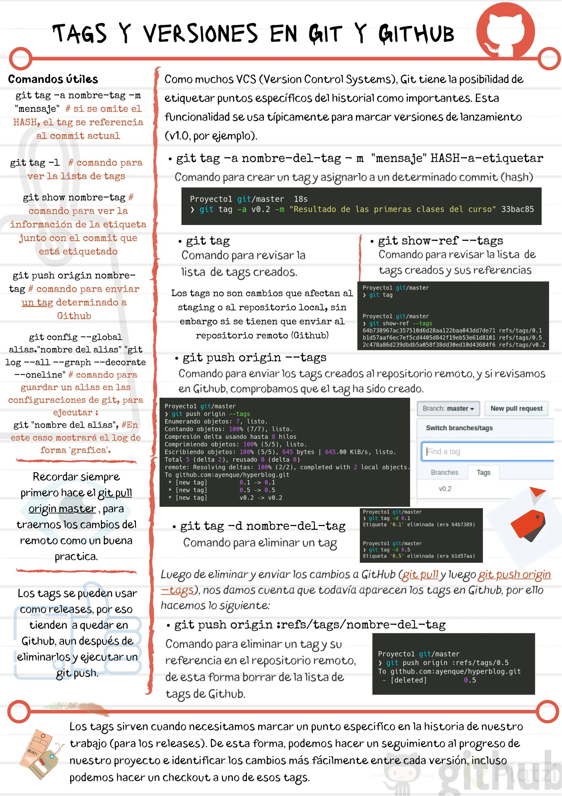

# üìπ video 24 - Manejo de ramas en GitHub

Las ramas nos permiten hacer cambios a nuestros archivos sin modificar la versión principal (master). Puedes trabajar con ramas que nunca envías a GitHub, así como pueden haber ramas importantes en GitHub que nunca usas en el repositorio local. Lo crucial es que aprendas a manejarlas para trabajar profesionalmente.

Si, estando en otra rama, modificamos los archivos y hacemos commit, tanto el historial(git log) como los archivos serán afectados. La ventaja que tiene usar ramas es que las modificaciones solo afectarán a esa rama en particular. Si luego de “guardar” los archivos(usando commit) nos movemos a otra rama (`git checkout otraRama`) veremos como las modificaciones de la rama pasada no aparecen en la otraRama.

+ `Comandos para manejo de ramas en GitHub`
    + Crear una rama: `git branch branchName`
    + Movernos a otra rama: `git checkout branchName`
    + Crear una rama en el repositorio local: `git branch nombre-de-la-rama o git checkout -b nombre-de-la-rama`.
    + Publicar una rama local al repositorio remoto: `git push origin nombre-de-la-rama`.

Recuerda que podemos ver gráficamente nuestro entorno y flujo de trabajo local con Git utilizando el comando gitk. Gitk fue el primer visor gráfico que se desarrolló para ver de manera gráfica el historial de un repositorio de Git.

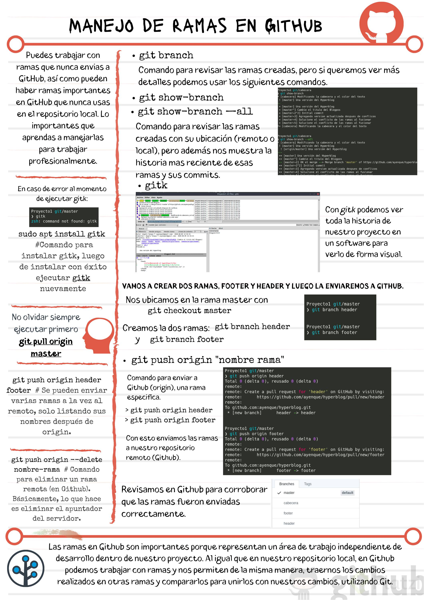

# üìπ video 25 - Configurar m√∫ltiples colaboradores en un repositorio de GitHub

Por defecto, cualquier persona puede clonar o descargar tu proyecto desde GitHub, pero no pueden crear commits, ni ramas. Esto quiere decir que pueden copiar tu proyecto pero no colaborar con él. Existen varias formas de solucionar esto para poder aceptar contribuciones. Una de ellas es añadir a cada persona de nuestro equipo como colaborador de nuestro repositorio.

## Cómo agregar colaboradores en Github

Solo debemos entrar a la configuración de colaboradores de nuestro proyecto. Se encuentra en:
Repositorio > Settings > Collaborators
Ahí, debemos añadir el email o username de los nuevos colaboradores.

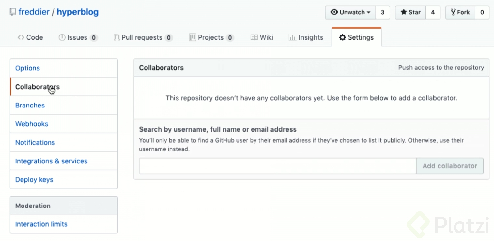

+ Si, como colaborador, agregaste erróneamente el mensaje del commit, lo puedes cambiar de la siguiente manera:
    + Hacer un commit con el nuevo mensaje que queremos, esto nos abre el editor de texto de la terminal: `git commit —amend`
    + Corregimos el mensaje
    + Traer el repositorio remoto: `git pull origin master`
    + Ejecutar el cambio: `git push --set-upstream origin master`.

# üìπ Video 26 - Flujo de trabajo profesional con Pull requests

En un entorno profesional normalmente se bloquea la rama master, y para enviar código a dicha rama pasa por un code review y luego de su aprobación se unen códigos con los llamados merge request.

Para realizar pruebas enviamos el código a servidores que normalmente los llamamos staging develop (servidores de pruebas) luego de que se realizan las pruebas pertinentes tanto de código como de la aplicación estos pasan a el servidor de producción con el ya antes mencionado merge request.
+ Un pull request es un estado intermedio antes de enviar el merge.
+ El pull request permite que otros miembros del equipo revisen el código y así aprobar el merge a la rama.
+ Permite a las personas que no forman el equipo , trabajar y colaborar con una rama.
+ La persona que tiene la responsabilidad de aceptar los pull request y hacer los merge tienen un perfil especial y son llamados DevOps.

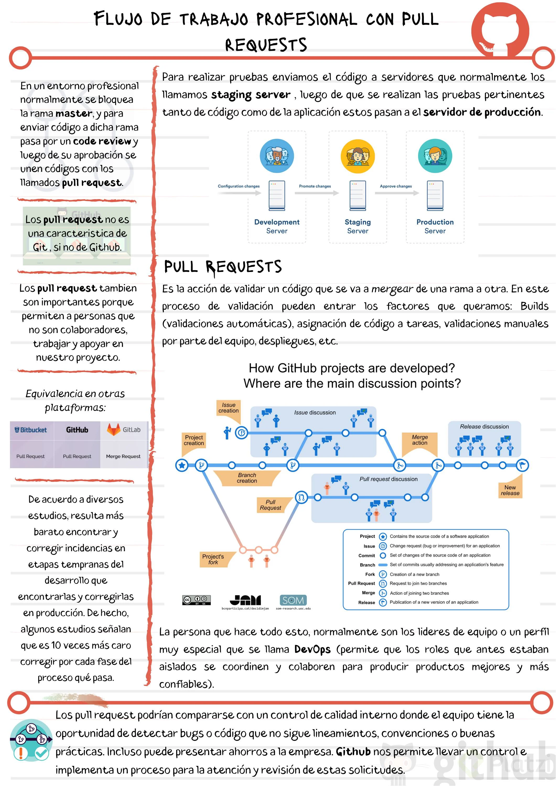

# video 27 - Flujo de trabajo profesional: Haciendo merge de ramas de desarrollo a master

+ Para poder desarrollar software de manera óptima y ordenada, necesitamos tener un flujo de trabajo profesional, que nos permita trabajar en conjunto sin interrumpir el trabajo de otros desarrolladores. Una buena práctica de flujo de trabajo sería la siguiente:
    + Crear ramas
    + Asignar una rama a cada programador
    + El programador baja el repositorio con git pull origin master
    + El programador cambia de rama
    + El programador trabaja en esa rama y hace commits
    + El programador sube su trabajo con git push origin #nombre_rama
    + El encargado de organizar el proyecto baja, revisa y unifica todos los cambios

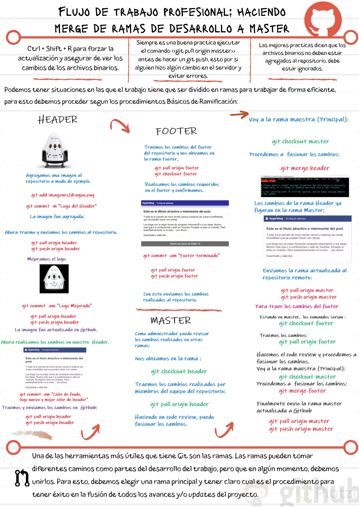


# üìπ Video 28 - Utilizando Pull Request en GitHub

Pull request es una funcionalidad de Github (en Gitlab llamada merge request y en Bitbucket push request), en la que un colaborador pide que revisen sus cambios antes de hacer merge a una rama, normalmente master (ahora conocida como main).

Al hacer un pull request, se genera una conversación que pueden seguir los demás usuarios del repositorio, así como autorizar y rechazar los cambios.

## Cómo se realiza un pull request
+ Se trabaja en una rama paralela los cambios que se desean git checkout -b <rama>.
+ Se hace un commit a la rama git commit -am '<Comentario>'.
+ Se suben al remoto los cambios git push origin <rama>.
+ En GitHub se hace el pull request comparando la rama master con la rama del fix.
+ Uno, o varios colaboradores revisan que el código sea correcto y dan feedback (en el chat del pull request).
+ El colaborador hace los cambios que desea en la rama y lo vuelve a subir al remoto (autom√°ticamente jala la historia de los cambios que se hagan en la rama, en remoto).
+ Se aceptan los cambios en GitHub.
+ Se hace merge a master desde GitHub.

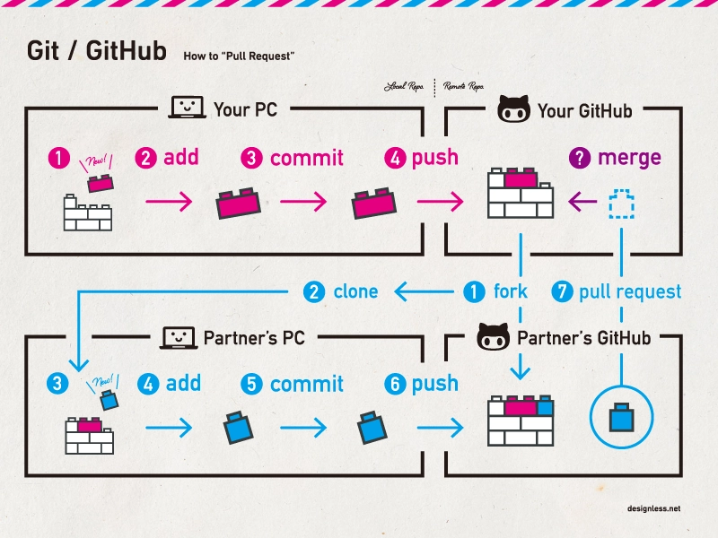

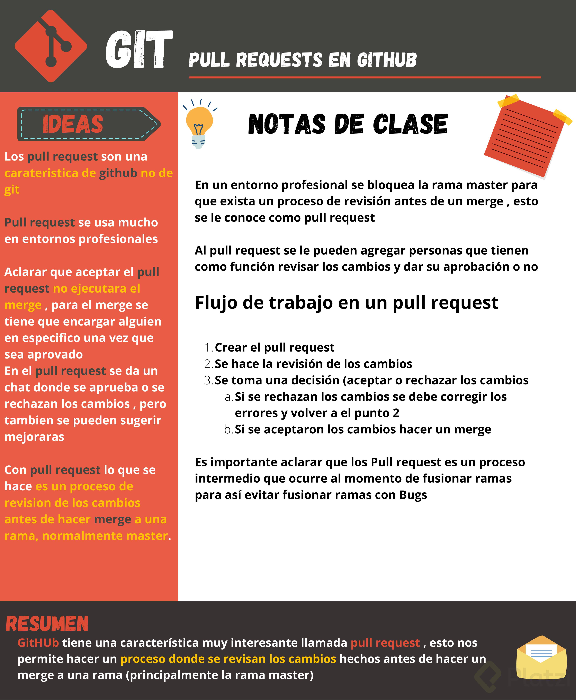

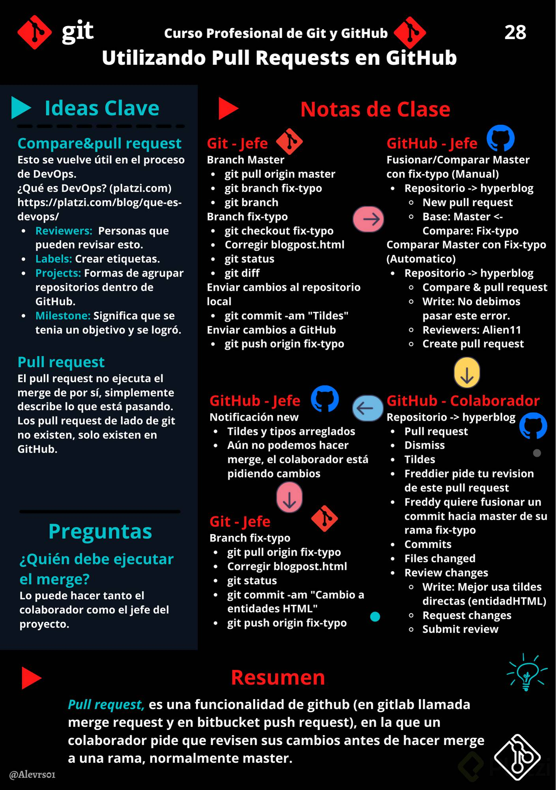

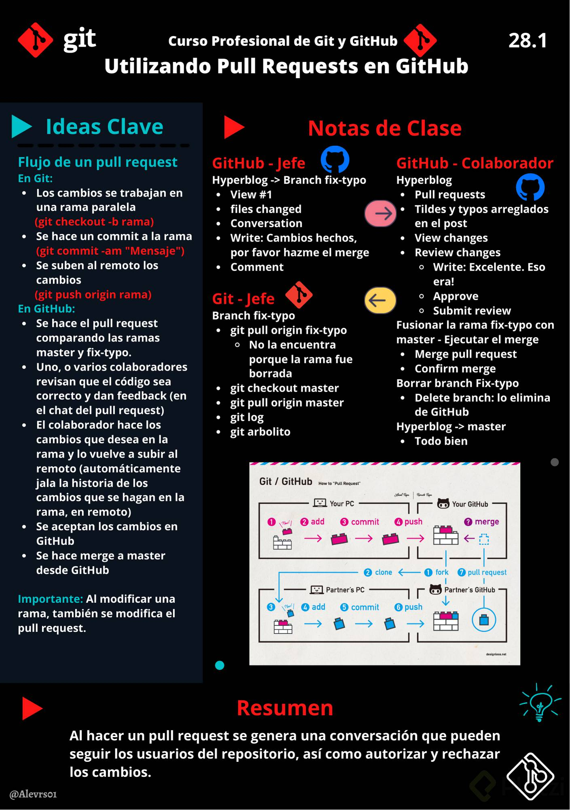

# üìπ Video 29 - Creando un Fork, contribuyendo a un repositorio

🗒️ Los forks o bifurcaciones son una característica única de GitHub en la que se crea una copia exacta del estado actual de un repositorio directamente en GitHub. Este repositorio podrá servir como otro origen y se podrá clonar (como cualquier otro repositorio). En pocas palabras, lo podremos utilizar como un nuevo repositorio git cualquiera.

Un fork es como una bifurcación del repositorio completo. Comparte una historia en común con el original, pero de repente se bifurca y pueden aparecer varios cambios, ya que ambos proyectos podrán ser modificados en paralelo y para estar al día un colaborador tendrá que estar actualizando su fork con la información del original.

Al hacer un fork de un poryecto en GitHub, te conviertes en dueñ@ del repositorio fork, puedes trabajar en este con todos los permisos, pero es un repositorio completamente diferente que el original, teniendo solamente alguna historia en común (como crédito al creado o creadora original).

Los forks son importantes porque es la manera en la que funciona el open source, ya que, una persona puede no ser colaborador de un proyecto, pero puede contribuír al mismo, haciendo mejor software que pueda ser utilizado por cualquiera.

## Cómo se hace un fork remoto desde consola en GitHub

Al hacer un fork, GitHub sabe que se hizo el fork del proyecto, por lo que se le permite al colaborador hacer pull request desde su repositorio propio.

Cuando trabajas en un proyecto que existe en diferentes repositorios remotos (normalmente a causa de un fork), es muy probable que desees poder trabajar con ambos repositorios. Para esto, puedes generar un remoto adicional desde consola.

<aside>
    git remote add <nombre_del_remoto> <url_del_remoto> 
    git remote upstream https://github.com/freddier/hyperblog
</aside>

Al crear un remoto adicional, podremos hacer pull desde el nuevo origen. En caso de tener permisos, podremos hacer fetch y push.

<aside>
    git pull <remoto> <rama>
    git pull upstream master
</aside>

Este pull nos traerá los cambios del remoto, por lo que se estará al día en el proyecto. El flujo de trabajo cambia, en adelante se estará trabajando haciendo pull desde el upstream y push al origin para pasar a hacer pull request.

<aside>
    git pull upstream master
    git push origin master
</aside>

+ Para subir cambios al repositorio original:
    + Ubicar el repositorio del proyecto open source con el cual quiero colaborar.
        + Watch ‚Üí Watching
        + Star
        + Fork: Tomar una copia del estado actual del proyecto y clonarlo, y queda como un proyecto mio.
    + Clonamos el repositorio en nuestro local.
    + Realizamos los cambios necesarios.
    + New Pull Request.


+ Para traer cambios del repositorio original:
    + Crear una nueva fuente para traer esos cambios:
        + git remote -v
        + git remote add upstream [original_repository_url]
        + git remote -v
        + git pull upstream master

+ Actualizar nuestro repositorio en Github
        + git push origin master

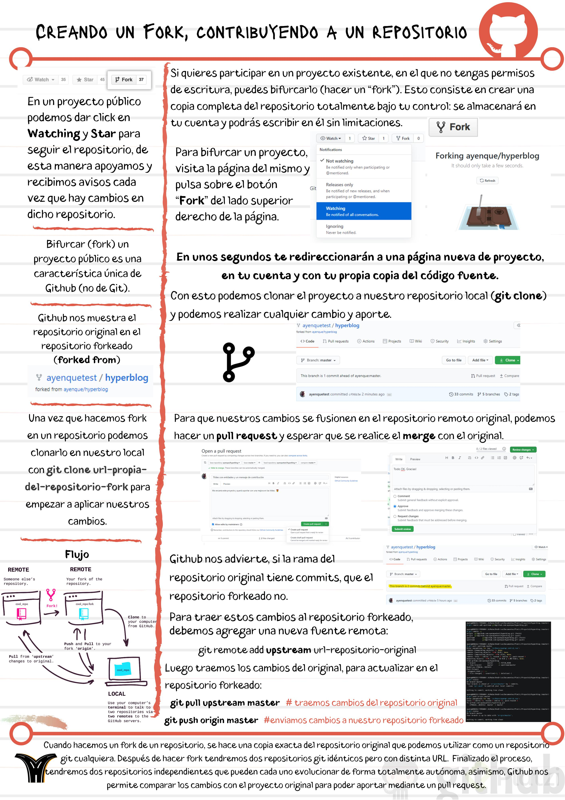

# üìπ Video 30 - Haciendo deployment a un servidor.

🗒️ Deploy es el proceso que permite enviar al servidor uno o varios archivos. Este servidor puede ser de prueba, desarrollo o producción.

En el siguiente ejemplo veremos cómo se realiza el deployment de un documento en un servidor web básico.

+ Pasos para hacer deployment en un servidor web:
    + Entrar a la capeta de los archivos del servidor.
    + Copiar link en clone, elegir entre HTTPS o SSH del repositorio a contribuir.
        - En la carpeta deseada se clona el repositorio:
        
<aside>
    git clone url
    Deploy:
</aside>

    + Realizar cambios y commit en GitHub.
    + Traer al Repositorio local las actualizacion para el servidor en la capeta de los archivos del servidor.

<aside>
    git pull ramaRemota main
</aside>

Nota: Siempre se debe proteger el archivo .git. Dependiendo del software para el servidor web, existen diferentes maneras. La conexión entre GitHub y el servidor se puede realizar mediante: Travis (pago) o Jenkis (Open source).